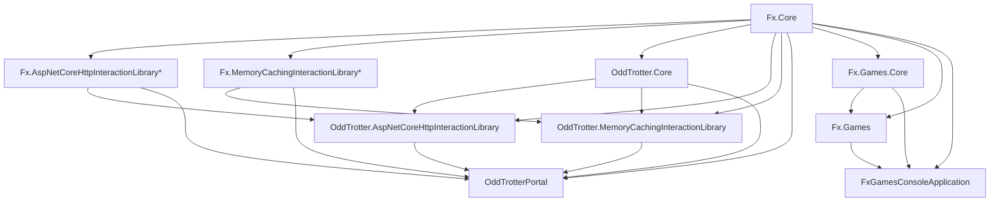

Fx.Core
Fx.AspNetCoreHttpInteractionLibrary*
Fx.MemoryCachingInteractionLibrary*
OddTrotter.Core
OddTrotter.AspNetCoreHttpInteractionLibrary
OddTrotter.MemoryCachingInteractionLibrary
OddTrotterPortal
Fx.Games.Core
Fx.Games <-- TODO why does this exist?
FxGamesConsoleApplication

TODO how do you want to separate Db stuff?

* doesn't exist yet

